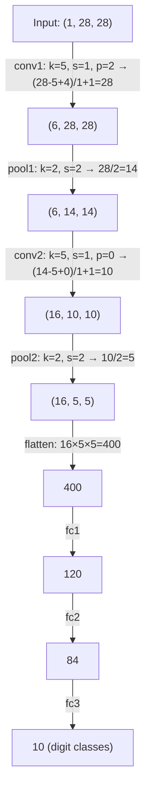

# ML Learning Notes

## PyTorch Ecosystem

### Q: What is `torch` (PyTorch)?
The core deep learning framework. It provides:
- **Tensors** — like NumPy arrays but with GPU support
- **Autograd** — automatic differentiation
- **Neural network modules** (`torch.nn`)
- Optimizers, loss functions, etc.

### Q: What is `torchvision`?
A companion library specifically for **computer vision**. It provides:
- **Datasets** — pre-built loaders for common datasets (MNIST, QMNIST, CIFAR, ImageNet, etc.)
- **Transforms** — image preprocessing (resize, crop, normalize, augment)
- **Pre-trained models** — ResNet, VGG, EfficientNet, etc.
- **Utilities** — image I/O, drawing bounding boxes, making grids

### Q: What other companion libraries exist for PyTorch?
- `torchaudio` — for audio tasks
- `torchtext` — for NLP tasks

---

## Image Preprocessing

### Q: What does `transforms.ToTensor()` do?
- Converts a PIL image or NumPy array with pixel values in **[0, 255]** into a PyTorch tensor with values in **[0.0, 1.0]**
- Rearranges dimensions from `(H, W, C)` to `(C, H, W)` (the format PyTorch expects)

### Q: What does `transforms.Normalize(mean, std)` do?
Applies standardization: `pixel = (pixel - mean) / std`

This centers data around 0, helping networks train faster and more stably.

### Q: What are the standard MNIST normalization values?
- Mean: **0.1307**
- Std: **0.3081**

(Computed across all pixel values in the MNIST training set.)

### Q: Why is the mean/std given as a tuple like `(0.1307,)`?
The tuple has one value per channel. MNIST is **grayscale (1 channel)**. For RGB you'd provide three values, e.g. `(0.485, 0.456, 0.406)`.

---

## Channels

### Q: What is a channel in the context of images?
A layer of an image representing one color component.

### Q: How many channels do RGB images have? What are they?
**3 channels**: Red, Green, Blue. Each is a 2D grid of intensity values.

### Q: How many channels does a grayscale image have?
**1 channel** — a single 2D grid of brightness values.

### Q: What is the shape of an MNIST image in PyTorch?
`(1, 28, 28)` — 1 channel, 28x28 pixels.

### Q: What are channels called in deeper layers of a CNN?
**Feature maps** — each channel captures a different learned pattern (edges, textures, shapes, etc.).

---

## Conv2d (2D Convolution)

### Q: What does a Conv2d layer do?
Slides a small filter (kernel) across an image, computing dot products at each position to produce an output feature map. It learns to detect spatial patterns.

### Q: What is `kernel_size`?
The size of the filter that slides over the image.
- `3` → 3x3 filter (most common)
- `5` → 5x5 filter (larger receptive field)
- `1` → 1x1 filter (mixes channels without spatial context)

### Q: What is `stride`?
How many pixels the kernel moves at each step.
- `stride=1` → output roughly same size as input
- `stride=2` → output roughly **half** the size (downsamples)

### Q: What is `padding`?
Extra pixels (usually zeros) added around the border of the input before convolving.
- `padding=0` → output shrinks by `kernel_size - 1`
- `padding=1` with `kernel_size=3` → output keeps the same spatial size

### Q: What is the formula for Conv2d output size?
`output_size = (input_size - kernel_size + 2 * padding) / stride + 1`

### Q: Given input=28, kernel=3, padding=1, stride=1, what is the output size?
`(28 - 3 + 2) / 1 + 1 = 28` — same spatial size.

### Q: What does `out_channels` mean in Conv2d?
The number of different filters the layer learns. Each filter produces one output feature map. For example, `out_channels=6` means 6 separate filters, each looking at the same input through a "different lens" — one might detect horizontal edges, another vertical edges, another corners, etc.

### Q: What is a feature map?
The 2D output produced by one filter in a conv layer. Each value in the grid represents **how strongly a particular pattern was detected at that spatial location** — like a heatmap for that pattern. "Feature map" and "channel" refer to the same thing, just from different perspectives:
- **Channel** — one slice of a multi-channel tensor
- **Feature map** — emphasizes it encodes a detected feature spatially

### Q: Why are kernel sizes usually odd (1, 3, 5, 7)?
Two reasons:
1. **Easy to preserve spatial size** — with `padding = kernel_size // 2` and `stride=1`, output size equals input size (e.g. kernel=3 + padding=1, kernel=5 + padding=2).
2. **Odd kernels have a center pixel**, giving the filter a well-defined anchor point. Even kernels lack a true center, which introduces asymmetric spatial shifts.

### Q: Why is uncontrolled spatial shrinking a problem?
If the output shrinks at every conv layer (no padding), three issues arise:
1. **You run out of spatial dimensions** — on a small image like 28x28, you hit 0 before reaching deeper layers.
2. **Edge information is lost** — border pixels participate in fewer convolutions than center pixels, so the network progressively forgets edges.
3. **Architecture becomes fragile** — you must manually track the exact size at every layer, making the network harder to design and modify.

### Q: What is the standard pattern for controlling spatial dimensions in a CNN?
- **Conv layers with padding** → preserve spatial size, extract features
- **Stride=2 conv or pooling** → intentionally downsample when you want to

This gives explicit control over where downsampling happens.

---

## Pooling

### Q: What is average pooling?
Slides a window over the input and outputs the **mean** of each window. It has **no learnable parameters**.

### Q: Is average pooling essentially a convolution with kernel weights of 1/(k*k)?
Yes, for a single channel it's mathematically identical. The key differences from a standard Conv2d are:
1. **No learnable parameters** — the kernel is fixed
2. **No channel mixing** — each channel is pooled independently (like a depthwise conv)
3. **Typical stride = kernel_size** — non-overlapping windows (default behavior)

### Q: Is pooling always a downsampling operation?
No — it depends on stride and padding. With `stride=1` and appropriate padding, pooling preserves spatial size (just smooths/blurs). But in practice, pooling is almost always used to downsample (`stride=kernel_size`).

### Q: What is Global Average Pooling?
`nn.AdaptiveAvgPool2d(1)` collapses an entire feature map into a **single value per channel**: `(C, H, W) → (C, 1, 1)`. Used at the end of many CNNs (ResNet, EfficientNet) to go from spatial feature maps to a flat vector before classification.

---

## LeNet Architecture (example)

### Q: Walk through the LeNet spatial dimensions for a 28x28 MNIST input.



Key observations:
- **conv1** uses `padding=2` to preserve spatial size (28→28)
- **conv2** uses no padding, so it shrinks (14→10)
- **Pooling layers** halve the spatial size each time
- **Channels increase** (1→6→16) as spatial size decreases — a common CNN pattern

---

## Activation Functions

### Q: What is the role of an activation function?
Without an activation function, stacking linear layers (conv, fully connected) is pointless — the entire network collapses into a **single linear transformation**, no matter how many layers you add. (A linear function of a linear function is still linear.)

Activation functions introduce **nonlinearity**, giving the network the ability to learn complex, non-linear patterns.

Example with conv + tanh:
- **Conv** detects a pattern and produces a raw score (any value)
- **Tanh** squashes it to (-1, 1): +1 = pattern strongly present, 0 = weak/unsure, -1 = opposite pattern present

### Q: What is sigmoid?
`σ(x) = 1 / (1 + e^(-x))`

Output range: **(0, 1)**. Historically used in early neural networks. Still used for binary classification outputs and gates (e.g. in LSTMs).

### Q: What is tanh?
`tanh(x) = (e^x - e^(-x)) / (e^x + e^(-x))`

Output range: **(-1, 1)**. Related to sigmoid: `tanh(x) = 2σ(2x) - 1`. Preferred over sigmoid for hidden layers because it's **zero-centered** (gradients don't all push the same direction).

### Q: What is ReLU? (~2012, AlexNet era)
`ReLU(x) = max(0, x)`

Output range: **[0, ∞)**. The breakthrough activation that enabled training deep networks:
- **Cheap to compute** — just a threshold, no exponentials
- **No vanishing gradient for positive values** — sigmoid/tanh flatten out for large inputs, making gradients tiny
- **Sparse activations** — outputs 0 for negative inputs

**Problem**: "dying ReLU" — neurons that output 0 for all inputs stop learning entirely because the gradient is 0.

### Q: What is Leaky ReLU?
`LeakyReLU(x) = x if x > 0, else 0.01x`

Fixes dying ReLU by allowing a small gradient (0.01) for negative inputs, so neurons can always recover.

### Q: What is GELU? (~2016, used in BERT, GPT)
`GELU(x) = x · Φ(x)` where Φ is the cumulative distribution function of the standard normal.

Approximation: `GELU(x) ≈ 0.5x(1 + tanh(√(2/π)(x + 0.044715x³)))`

Unlike ReLU's hard cutoff at 0, GELU provides a **smooth, probabilistic gate** — it smoothly blends between passing and blocking values. Became the default in Transformers (BERT, GPT-2/3).

### Q: What is SiLU / Swish? (~2017)
`SiLU(x) = x · σ(x)`

Output range: **(≈-0.28, ∞)**. Like GELU, it's smooth and non-monotonic (dips slightly negative). Self-gated: the input modulates itself through sigmoid.

### Q: What is SwiGLU? (~2020, used in LLaMA, PaLM)
`SwiGLU(x, W, V, b, c) = SiLU(xW + b) ⊙ (xV + c)`

Not a simple element-wise activation — it's a **gated linear unit** that splits the computation into two paths:
1. One path through SiLU (the gate)
2. One path as a linear projection (the value)
3. Multiply element-wise (⊙)

This lets the network **learn which information to pass through**. Used in the FFN layers of LLaMA, PaLM, and most modern LLMs.

### Q: Timeline summary of activation functions?

| Era | Activation | Key advance |
|-----|-----------|-------------|
| ~1990s | **Sigmoid** | First widely used, but vanishing gradients |
| ~1990s | **Tanh** | Zero-centered, stronger gradients than sigmoid |
| ~2012 | **ReLU** | Enabled deep networks, cheap, no vanishing gradient |
| ~2015 | **Leaky ReLU** | Fixed dying ReLU problem |
| ~2016 | **GELU** | Smooth gating, default for Transformers |
| ~2017 | **SiLU/Swish** | Smooth, self-gated, used in EfficientNet |
| ~2020 | **SwiGLU** | Gated unit with learned gating, default in modern LLMs |

The trend: from **hard thresholds** (ReLU) → **smooth gating** (GELU/SiLU) → **learned gating with two projections** (SwiGLU). Each step gives the network more expressive control over information flow.

---

## DataLoader

### Q: What is a DataLoader?
A `DataLoader` wraps a dataset and handles **batching, shuffling, and feeding data** to your model. Instead of passing all images at once (too much memory) or one at a time (too slow), it serves them in batches.

```python
train_loader = DataLoader(train_set, batch_size=64, shuffle=True)
```

### Q: What is the shape of data coming out of a DataLoader?
Each iteration yields a tuple `(images, labels)`:
- **images**: `(batch_size, C, H, W)` — e.g. `(64, 1, 28, 28)` for a batch of 64 MNIST images
- **labels**: `(batch_size,)` — e.g. `(64,)` containing the digit class for each image

The first dimension is always the **batch dimension**. Access it with `images.size(0)`.

The last batch may be smaller if the dataset size isn't divisible by batch_size (e.g. 50,000 / 64 → last batch has 32).

### Q: Why shuffle the training DataLoader?
Without shuffling, the model sees data in the same fixed order every epoch:
1. **Gradient bias** — if all "0" digits come first then all "1"s, weight updates are biased toward whatever class was just seen
2. **Spurious patterns** — the model can learn the ordering instead of actual features
3. **Poorer generalization** — shuffling acts as regularization; each epoch has different batch compositions giving different gradient signals

### Q: Why NOT shuffle validation/test loaders?
No weight updates happen — you're just measuring performance. Fixed order makes results **reproducible** and is slightly more efficient.

### Q: What does `images.size(0)` return?
The first dimension of the tensor = the **batch size**. Use this instead of hardcoding `64` because the last batch is often smaller.

### Q: Why multiply `loss.item() * images.size(0)` when tracking epoch loss?
`CrossEntropyLoss` returns the **average loss** across the batch by default. Multiplying by batch size converts it to **total loss** for that batch. This ensures the smaller last batch doesn't have equal weight to full batches when computing the epoch average: `total_loss / total_samples`. This also makes the loss comparable across epochs — you can see "loss went from 0.30 to 0.15" and know the model is improving, rather than looking at some arbitrary large number.

### Q: What does `.item()` do?
Converts a single-element tensor to a plain Python float. Important because tensors carry the computation graph — storing them in a list every iteration leaks memory. `.item()` extracts just the number.

---

## Training vs. Evaluation Mode

### Q: What do `model.train()` and `model.eval()` do?
They toggle a mode flag that changes the behavior of certain layers. They do **not** perform any training or evaluation themselves.

### Q: Which layers behave differently between train and eval mode?

| Layer | `model.train()` | `model.eval()` |
|-------|-----------------|-----------------|
| **Dropout** | Randomly zeroes neurons (regularization) | Disabled, all neurons active |
| **BatchNorm** | Uses current batch statistics, updates running averages | Uses stored running averages |

Layers like Conv2d, Linear, ReLU, and pooling behave **identically** in both modes.

### Q: What is Batch Normalization?
Normalizes the inputs to a layer **across the current mini-batch**:

\[
\hat{x} = \frac{x - \mu_{\text{batch}}}{\sqrt{\sigma^2_{\text{batch}} + \epsilon}}
\]

Then applies learned parameters: \(\gamma \hat{x} + \beta\), where \(\gamma\) (scale) and \(\beta\) (shift) are trainable.

### Q: Why is BatchNorm useful?
- **Stabilizes training** — as weights change, layer output distributions shift (internal covariate shift). BatchNorm keeps them normalized.
- **Allows higher learning rates** — gradients are better behaved with normalized inputs.
- **Mild regularization** — each sample's normalization depends on the other samples in the batch, adding noise.

### Q: Why does BatchNorm need different behavior in train vs. eval?
- **Train**: computes \(\mu\) and \(\sigma^2\) from the current batch. Also maintains a running average of these statistics across batches.
- **Eval**: uses the stored running averages. This is critical because at inference you might have a single sample (no meaningful batch statistics), and you need deterministic outputs.

### Q: Where is BatchNorm typically placed?
After a conv or linear layer, before the activation:
```python
x = F.relu(self.bn1(self.conv1(x)))
```
`BatchNorm2d` for conv layers (normalizes per channel across H, W, and batch). `BatchNorm1d` for fully connected layers.

### Q: What is Dropout?
Randomly sets a fraction of activations to zero during training. This forces the network to not rely on any single neuron, improving generalization.
```python
self.dropout = nn.Dropout(p=0.5)  # 50% of activations zeroed each forward pass
```
At eval time, dropout is disabled and activations are scaled by \(1 - p\) to compensate (or equivalently, training activations are scaled by \(\frac{1}{1-p}\), which is what PyTorch does by default).

### Q: What happens if you forget to call `model.eval()` before inference?
- **Dropout** stays active — randomly zeroing neurons gives noisy, non-deterministic predictions.
- **BatchNorm** uses the current input's statistics instead of the stored running averages — results vary depending on the batch composition and size.

---

## Loss Functions

### Q: What is CrossEntropyLoss and when is it used?
The standard loss for **multi-class classification** (exactly one correct class per input). Combines `LogSoftmax` + `NLLLoss`. Takes raw logits, converts to probabilities, and penalizes based on the probability assigned to the correct class.

### Q: What is BCEWithLogitsLoss and when is it used?
Loss for **binary classification** or **multi-label classification** (where multiple labels can be true simultaneously). Combines `Sigmoid` + `BCELoss`.

### Q: What is MSELoss and when is it used?
**Regression** loss — predicting continuous values (prices, temperatures). Penalizes large errors heavily (quadratic penalty).

### Q: What is L1Loss and when is it used?
**Regression** loss — more robust to outliers than MSE because it penalizes linearly instead of quadratically.

### Q: What is HuberLoss and when is it used?
**Regression** loss — behaves like MSE for small errors and L1 for large errors. Best of both worlds: smooth gradients near zero, robustness to outliers far from zero.

### Quiz: Match each formula to its loss function

**Loss functions:** CrossEntropyLoss, BCEWithLogitsLoss, MSELoss, L1Loss, HuberLoss

**A.**

\[
L = \frac{1}{N} \sum_{i=1}^{N} |y_i - \hat{y}_i|
\]

<details><summary>Answer</summary>

**L1Loss (Mean Absolute Error)** — the absolute difference, linear penalty.

</details>

**B.**

\[
L = -\frac{1}{N} \sum_{i=1}^{N} \left[ y_i \log(\sigma(\hat{y}_i)) + (1 - y_i) \log(1 - \sigma(\hat{y}_i)) \right]
\]

<details><summary>Answer</summary>

**BCEWithLogitsLoss** — binary cross-entropy with built-in sigmoid (\(\sigma\)). The \(y_i \in \{0, 1\}\) terms select which branch contributes.

</details>

**C.**

\[
L = \frac{1}{N} \sum_{i=1}^{N} (y_i - \hat{y}_i)^2
\]

<details><summary>Answer</summary>

**MSELoss (Mean Squared Error)** — squared difference, quadratic penalty.

</details>

**D.**

\[
L = -\frac{1}{N} \sum_{i=1}^{N} \log \frac{e^{\hat{y}_{i,c_i}}}{\sum_{j=1}^{C} e^{\hat{y}_{i,j}}}
\]

where \(c_i\) is the correct class for sample \(i\).

<details><summary>Answer</summary>

**CrossEntropyLoss** — softmax over logits, then negative log-likelihood of the correct class. The fraction is the softmax probability assigned to the true class.

</details>

**E.**

\[
L = \frac{1}{N} \sum_{i=1}^{N}
\begin{cases}
\frac{1}{2}(y_i - \hat{y}_i)^2 & \text{if } |y_i - \hat{y}_i| \leq \delta \\
\delta \left( |y_i - \hat{y}_i| - \frac{1}{2}\delta \right) & \text{otherwise}
\end{cases}
\]

<details><summary>Answer</summary>

**HuberLoss** — quadratic (MSE) for small errors (\(\leq \delta\)), linear (L1) for large errors. The threshold \(\delta\) controls the transition.

</details>

---

## Matplotlib (`plt`)

### Q: How do you display a grayscale image tensor with matplotlib?
```python
plt.imshow(img.squeeze(), cmap="gray")
plt.show()
```
`.squeeze()` removes the channel dimension (from `(1, H, W)` to `(H, W)`).

### Q: What are the main plot types in matplotlib?
- `plt.plot(x, y)` — line plot
- `plt.scatter(x, y)` — scatter plot
- `plt.bar(x, y)` — bar chart
- `plt.hist(data, bins=N)` — histogram
- `plt.imshow(image)` — display image

### Q: How do you create subplots?
```python
fig, axes = plt.subplots(rows, cols, figsize=(w, h))
axes[i].imshow(img)
```
